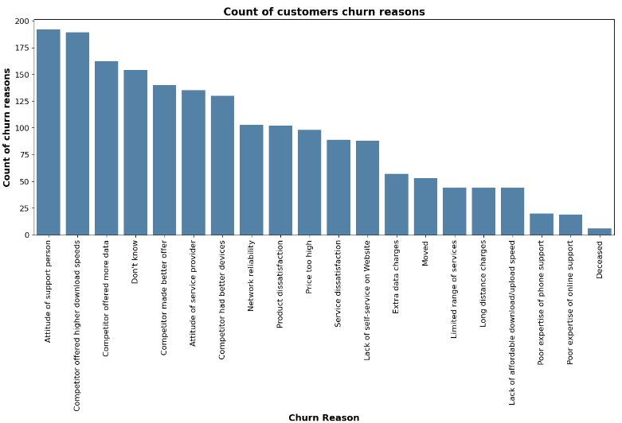
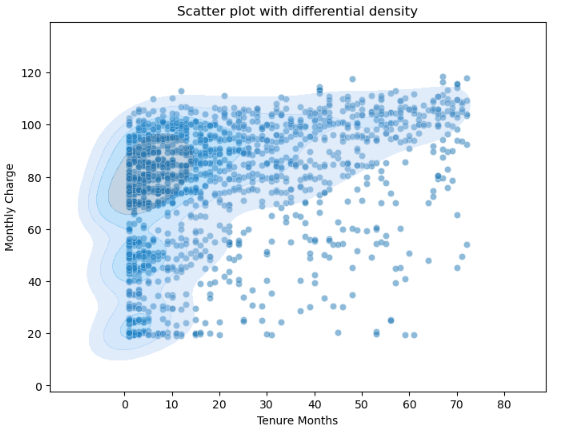
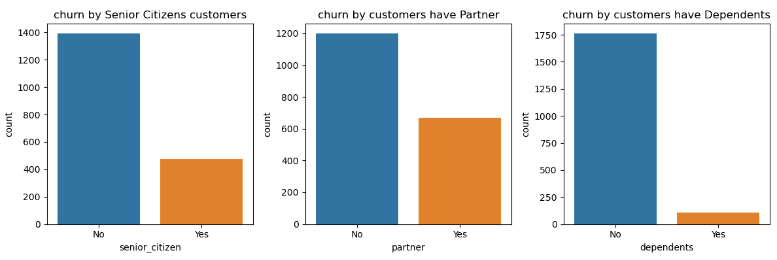
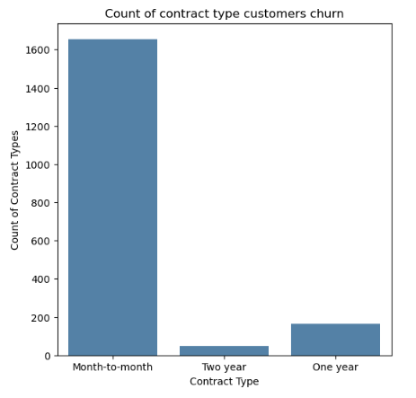
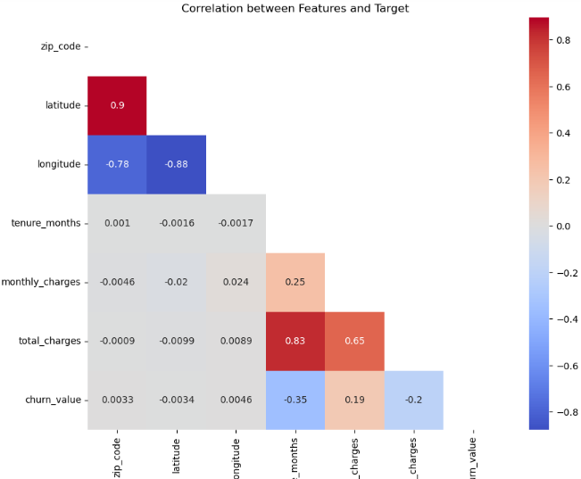
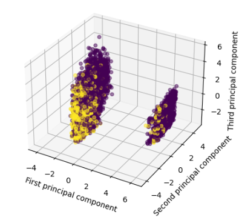
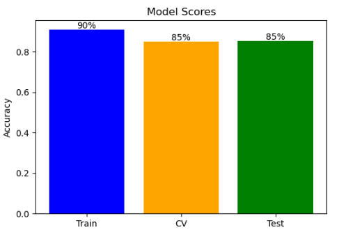

# Telco Churn Analysis and Prediction

This project aims to analyze and predict customer churn for a fictional telco company in California. The company provided home phone and internet services to 7043 customers in Q3.

### Data Cleaning
The first step was to clean the data by filling null values, editing data types to their corresponding type, and checking for outliers.

### EDA
I conducted exploratory data analysis to answer several questions and gain insights into the data. For instance, I found that the attitude of the support person was the most common reason for customer churn. Additionally, 40% of customers left the company due to better offers from competitors.

I also explored the relation between tenure months, monthly charge, and customer churn. It turns out that customers who pay more than 75 in the first three months of the year are the most likely to churn.

 
I also investigated the impact of being a senior citizen, having a partner, or having dependents on churn decision. I discovered that 35% of customers who have a partner and 25% of senior citizen customers churn the company.

Finally, I investigated the most common contract type for customers who churn, which was a month-to-month contract.

### Build ML Model
In this stage, feature engineering was done, and the right features were selected to train the model. It was found that location columns (zip_code, latitude, longitude) had a weak relationship with churn value, while charge columns (tenure_months, monthly_charge, total_charge) had a moderate relationship.

Categorical data were encoded and a baseline model was built with logistic regression, achieving an accuracy of 79%.

To address the variance between features, PCA was used, and it was found that the data was not well separated. Based on that and the not-correlated features, a tree-based model (XGBoost) was selected.

The data was oversampled using ADASYN, and a randomized search was used to select the best parameters. The final model achieved a test accuracy of 85%.

Conclusion
Despite the small and imbalanced dataset with a limited number of features, this project successfully built a machine learning model to predict customer churn. The insights gained from EDA can help the company take actions to reduce customer churn. Furthermore, this model can be modified to fit business requirements, with a high priority given to customers who are expected to churn or stay based on business targets.

